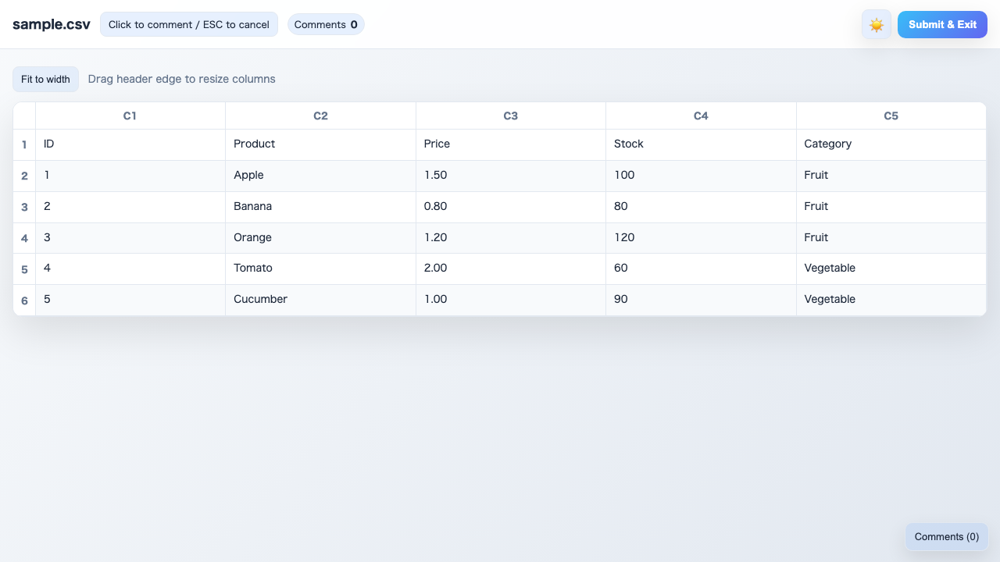
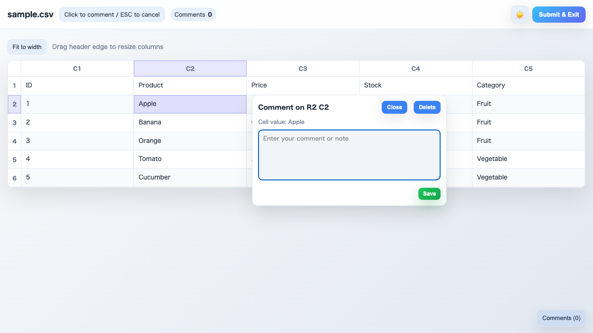
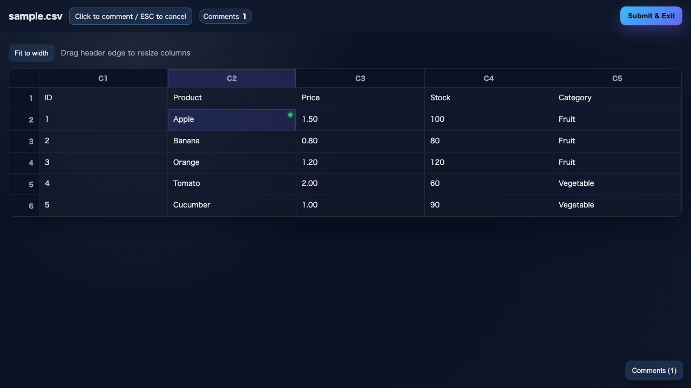
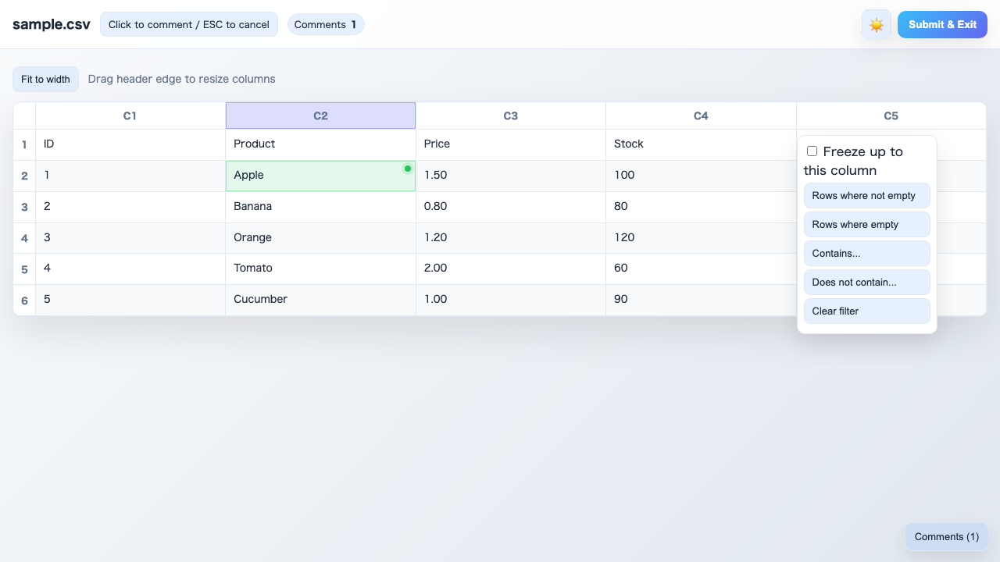
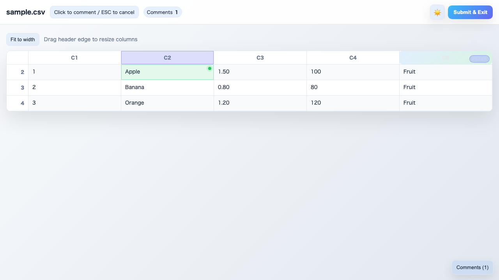
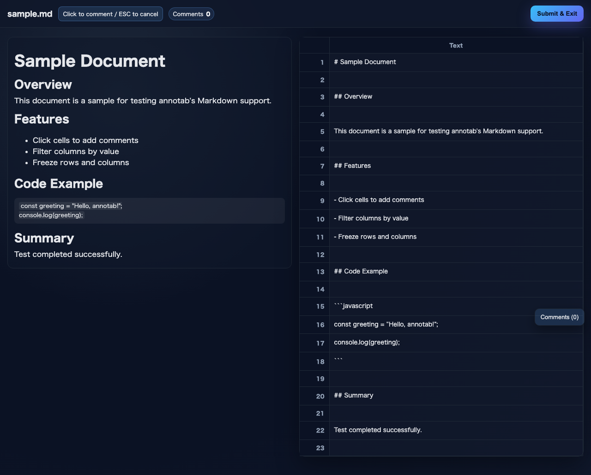
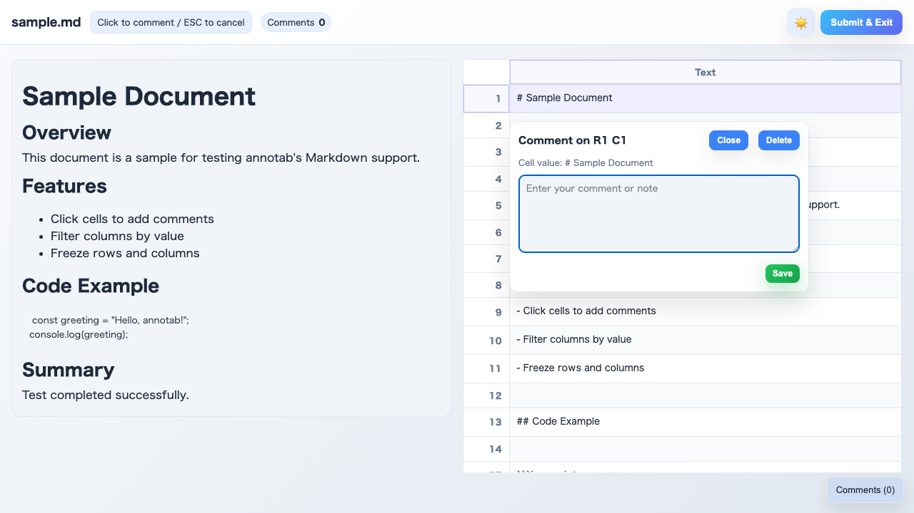
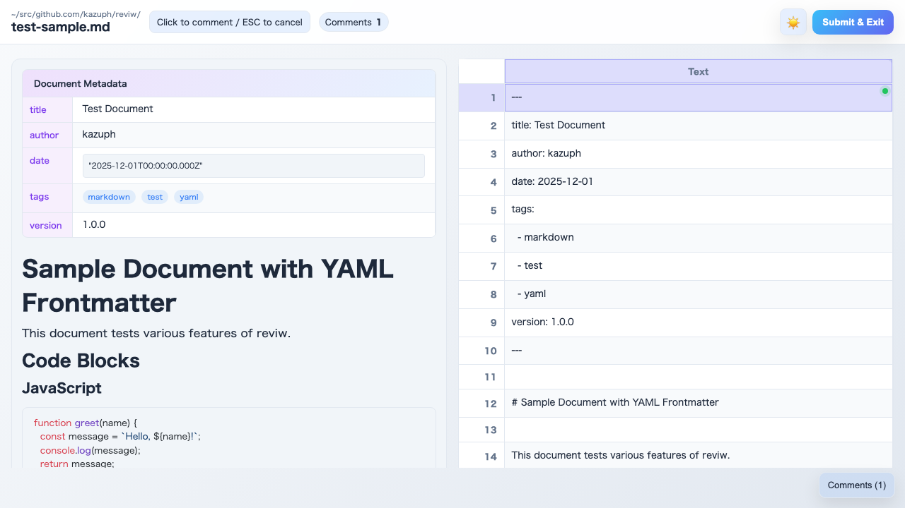

# annotab E2E Test Report

**実行日時**: 2024-11-26
**テストツール**: Playwright
**対象**: CSV / Markdown ファイルの表示・コメント機能

---

## CSV E2E Tests

CSVファイルを読み込み、テーブル表示・コメント追加・フィルター機能をテストしました。

### 1. 初期表示

CSVファイル `sample.csv` を読み込み、正しくテーブルが表示されることを確認。

- ヘッダーに列番号 (C1〜C5) が表示される
- データ行が6行表示される
- 行番号が左端に表示される

---

### 2. コメントカード表示

セルをクリックするとコメント入力カードが表示されることを確認。

- セル位置 (R2 C2) が表示される
- セルの値が「りんご」と表示される
- テキストエリアでコメント入力可能

---

### 3. コメント保存

コメントを入力して保存ボタンを押すと、セルにインジケーターが表示されることを確認。

- セルの右上に緑のドットが表示される
- セルの背景色が変化する
- コメント数のバッジが更新される

---

### 4. フィルターメニュー

列ヘッダーをクリックするとフィルターメニューが表示されることを確認。

- 「この列が空でない行」
- 「この列が空の行」
- 「値に含む…」
- 「値に含まない…」
- 「この列のフィルタ解除」

---

### 5. フィルター適用

「値に含む…」で「果物」を入力し、フィルターが適用されることを確認。

- カテゴリが「果物」の行のみ表示される
- 野菜のデータ行は非表示になる
- 列ヘッダーにフィルターインジケーターが表示される

---

## Markdown E2E Tests

Markdownファイルを読み込み、プレビュー表示・ソース行コメント機能をテストしました。

### 1. 初期表示（プレビュー + ソース）

Markdownファイル `sample.md` を読み込み、プレビューとソースが並んで表示されることを確認。

- 左側にMarkdownがHTMLとしてレンダリングされたプレビュー
- 右側にソース行のテーブル
- 見出し、箇条書き、コードブロックが正しく表示される

---

### 2. コメントカード表示

ソース行をクリックするとコメント入力カードが表示されることを確認。

- 行位置 (R1 C1) が表示される
- ソース行の内容がプレビューされる
- テキストエリアでコメント入力可能

---

### 3. コメント保存

コメントを入力して保存すると、ソース行にインジケーターが表示されることを確認。

- 行の右上に緑のドットが表示される
- 行の背景色が変化する

---

### 4. コメント一覧パネル

複数のコメントを追加し、コメント一覧パネルを表示。

- 右下のトグルボタンでパネルの表示/非表示を切り替え
- コメントがセル位置とともにリスト表示される
- コメント数がバッジに表示される

---

### 5. コードブロック表示

Markdownのコードブロックが正しくレンダリングされることを確認。

- シンタックスハイライト付きで表示
- 背景色がコード用にスタイリング
- 改行やインデントが保持される

---

## テスト結果サマリー

| テスト種別 | テスト数 | 成功 | 失敗 |
|-----------|---------|------|------|
| CSV E2E   | 1       | 1    | 0    |
| Markdown E2E | 1    | 1    | 0    |
| **合計**  | **2**   | **2**| **0**|

**結果: 全テスト成功**
