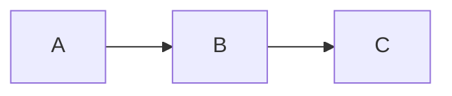
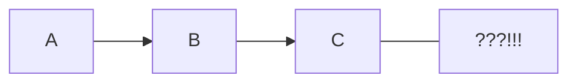

# Mermaid Error Test

## Valid Mermaid



## Broken Mermaid (syntax error)



## Another broken one

```mermaid
sequenceDiagram
    Alice ->> Bob Hello
    Bob -->> Alice ???
    invalid syntax here !!!
```

## Normal content

This is just regular text after the broken mermaid.
