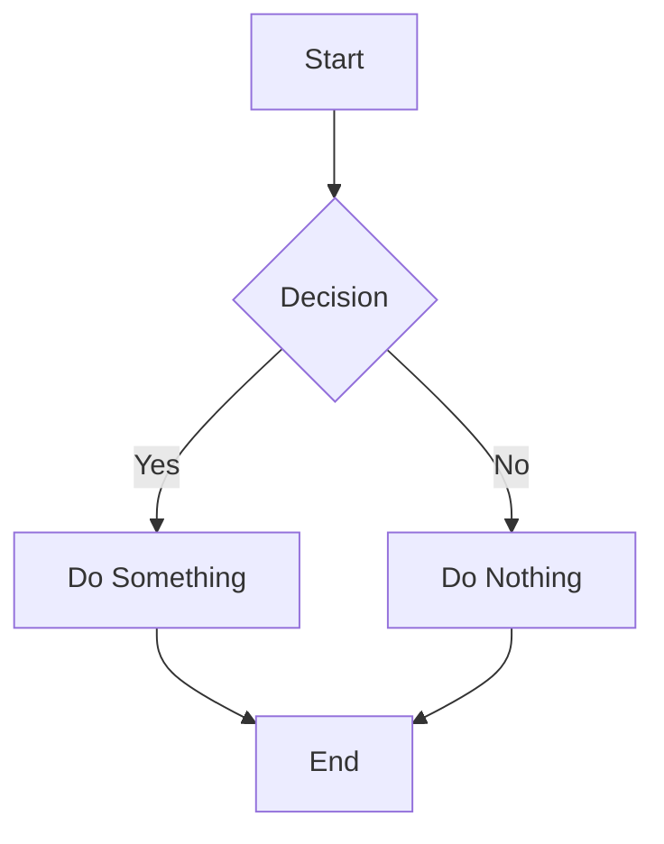

# Mixed Media Test

This document tests media sidebar with mixed content types.

## Section 1: Image

Here's a screenshot:

## Section 2: First Video

A short test video:

## Section 3: Another Image

## Section 3.5: Portrait Screenshots

Smartphone-like tall screenshots:

## Section 4: Mermaid Diagram

## Section 5: Second Video

A different video to check timeline independence:

## Section 6: Third Video

## Section 7: Final Image

## Notes

- Check that each video's timeline shows correct timestamps
- Check that thumbnails in sidebar match the actual content
- Check that arrow key navigation works for video timelines
- Check that video duration matches timeline range
