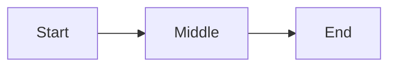

# Preview Regression Fixture

## Interactive Targets

This paragraph is the primary preview click target used to verify that the
comment dialog does not cover the selected area.

> This blockquote is intentionally short.
> It is used to verify quote selection and comment placement.

| Kind | Value |
|------|-------|
| Alpha | 1 |
| Beta | 2 |

```javascript
const firstLine = "code block target";
const secondLine = "still part of the code block";
console.log(firstLine, secondLine);
```




### Closing Note

Final paragraph that keeps the document long enough for scroll-sensitive
selection and gives the heading toggle a second section boundary.
