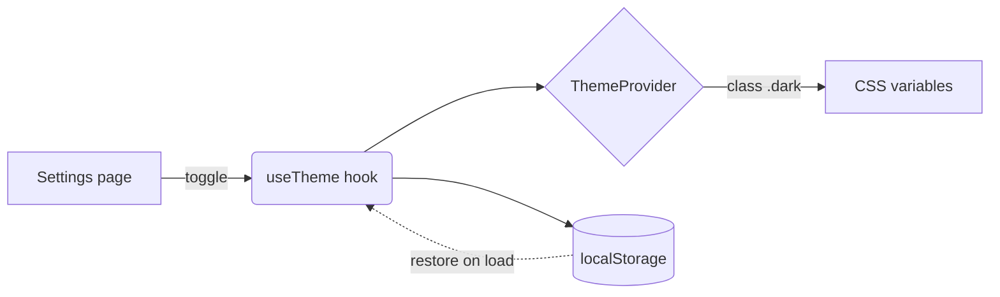
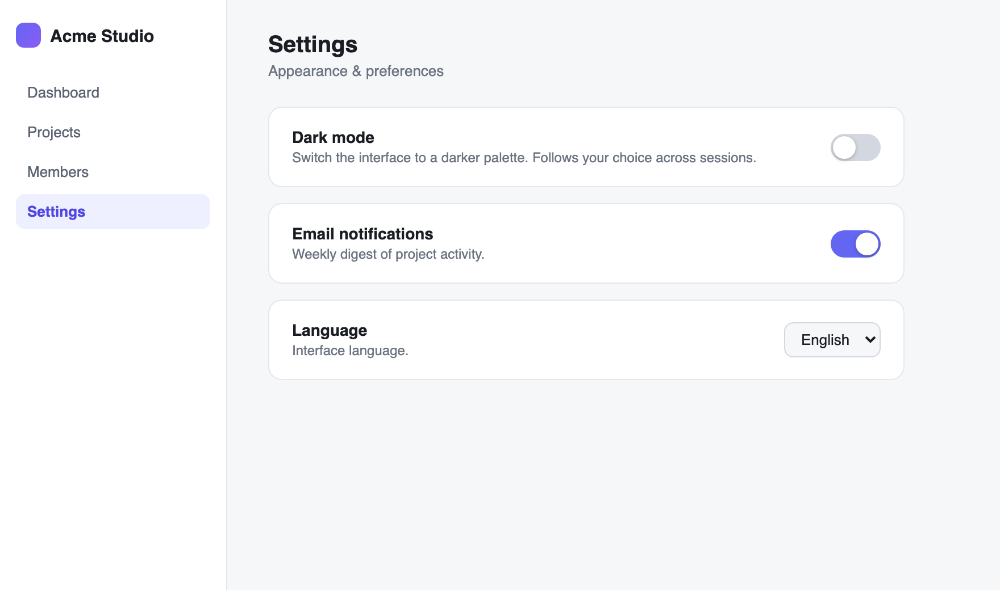
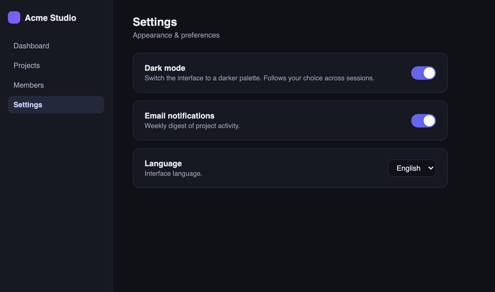

# REPORT: Add dark-mode toggle to Settings

> **Your request**: *"Add a dark mode toggle to the settings page, and persist the user's choice."*

All done and verified. Here is what I changed, why, and the proof. 🍵

## Why

The app only shipped a light palette. Users working at night asked for a darker theme, and the design team already had dark tokens defined — they were just never wired to a control.

## How



The toggle drives a `useTheme` hook. The choice is written to `localStorage` and restored before first paint, so there is no flash of the wrong theme.

## What changed

| File | Change |
|------|--------|
| `src/hooks/useTheme.ts` | new — theme state + persistence |
| `src/pages/Settings.tsx` | added the Dark mode card |
| `src/styles/tokens.css` | dark palette variables |

## Evidence

| Before | After |
|--------|-------|
|  |  |

## Test results

```
✓ useTheme persists choice to localStorage        (12 ms)
✓ theme restored before first paint               (31 ms)
✓ toggle is keyboard accessible                   (18 ms)

Test suites: 3 passed · 27 tests passed · 0 failed
```

Ready for your verdict — approve, or hand the cup back with comments.
