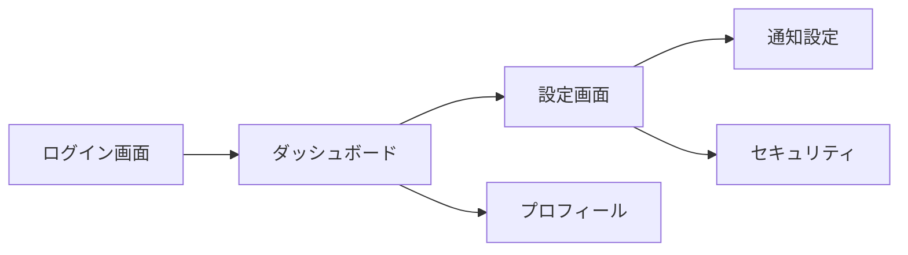
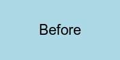
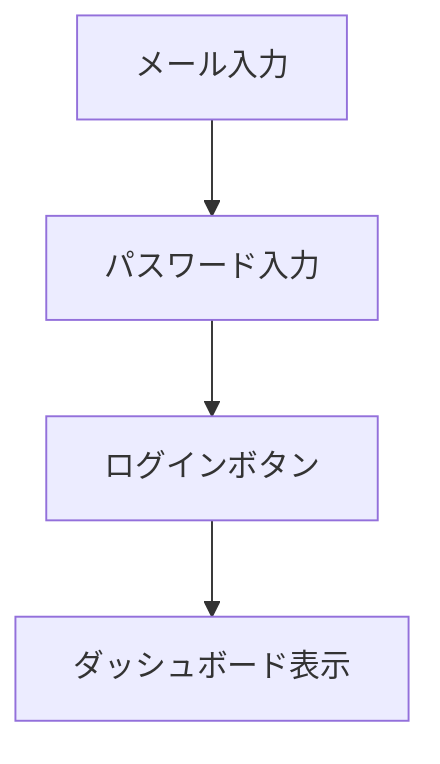
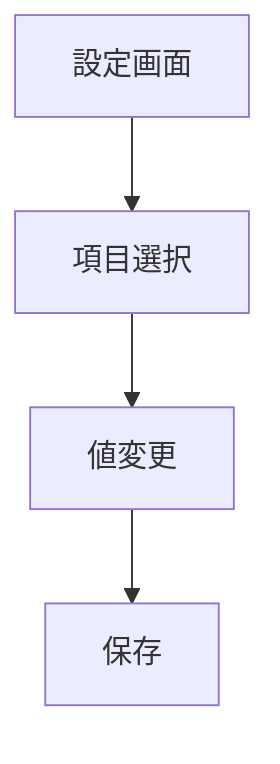

# REPORT.md 新機能検証

## 1. Toggle記法（折りたたみ）のテスト

<details>
<summary>クリックして展開：詳細な実装メモ</summary>

ここに折りたたまれた内容が入ります。

- 項目1
- 項目2
- 項目3

```javascript
// コードブロックも含められる
const test = () => {
  console.log("Hello");
};
```

</details>

<details>
<summary>E2E Health Review 詳細（折りたたみ例）</summary>

### goto制限チェック詳細
| ファイル | 行 | コード | 判定 |
|---------|-----|--------|------|
| login.e2e.ts | 15 | `page.goto('/')` | ✅ OK |
| dashboard.e2e.ts | 42 | `page.goto('/settings')` | ❌ 違反 |

</details>

---

## 2. 画面遷移全体像（Mermaid）



## 3. Evidence (証拠)

### Screenshots（テーブル記法必須）

| Before | After |
|--------|-------|
|  |  |

### 画面遷移フロー + 動画

**注意**: テーブル内にコードフェンス(```)を入れるとMarkdownパーサーが混乱するため、Mermaidはテーブル外に配置する必要があります。

| 動画 | 説明 |
|------|------|
| 📹 [ログインフロー](./videos/login-flow.webm) | ログイン操作のデモ動画 |
| 📹 [設定変更フロー](./videos/settings-flow.webm) | 設定変更のデモ動画 |

#### ログインフロー図


#### 設定変更フロー図


### 動画プレビュー（画像記法でサムネイル表示）

| 動画プレビュー | 説明 |
|---------------|------|
|  | 動画がサムネイル付きで表示される |

### 動画一覧（代替テーブル形式）

| 動画ファイル | 説明 | フロー |
|-------------|------|--------|
| login-demo.webm | ログイン操作 | Login → Dashboard |
| settings-demo.webm | 設定変更 | Settings → Save |

---

## 4. E2E Health Review (自動追記)

### goto制限チェック
| ファイル | 行 | コード | 判定 |
|---------|-----|--------|------|
| auth.e2e.ts | 10 | `page.goto('/')` | ✅ OK |

### 総合判定
- スコア: 4/5

---

## Notes

- Toggle記法が正しく動作するか確認
- Mermaid図がレンダリングされるか確認
- テーブル内の画像が展開されるか確認
