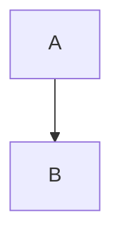
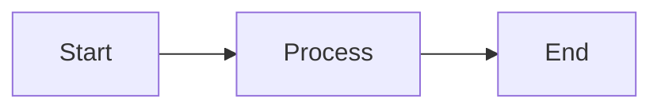

# Artifact Proof

An operational workflow for preserving development evidence (screenshots, videos, logs) in `.artifacts/<feature>/` and reusing it for PR descriptions.
Assumes human-in-the-loop visual regression, requiring screenshots to be retaken and verified before commits and PR pushes.

## Report Creation Rules (MANDATORY - 4 Rules)

**Every report MUST follow these rules. Violations will result in rejection.**

### Rule 1: Language Policy
- **Skill instructions**: Written in English for universal understanding
- **REPORT.md content**: Write in the user's language (日本語で依頼されたら日本語で作成)
- Match the language used by the user in their requests
- Technical terms and code identifiers can remain in English

### Rule 2: Media Format (Images & Videos)
- **ALWAYS use `` syntax** for both images AND videos (image syntax, NOT link `[]()`)
- **ALWAYS place inside tables** to arrange 2-3 columns horizontally
- **Vertical stacking is PROHIBITED** - forces unnecessary scrolling

```markdown
<!-- ✅ CORRECT: Table layout -->
| Before | After |
|--------|-------|
|  |  |

| Video | Flow | Description |
|-------|------|-------------|
|  | Step1 → Step2 → Step3 | Demo |

<!-- ❌ WRONG: Vertical stacking -->


```

### Rule 3: Priority Ordering (Critical First)
- **Critical/High severity issues → TOP of report** (クリティカルなものほど上部に)
- Previous feedback response → Second (累積履歴)
- Evidence (screenshots/videos) → Third
- Non-critical details → Collapse with `<details>` tags

### Rule 4: Feedback Accumulation (Original Text Required)
- **Record user feedback in near-original text** (ほぼ原文で累積ログとして残す)
- **NEVER summarize or paraphrase** - preserve exact wording
- **Register as TODO immediately** upon receiving feedback (指摘された直後にTodo化がベター)
- Accumulate across ALL iterations - never delete previous rounds

```
When user says: "ボタンの色が仕様と違う"
Record exactly: "ボタンの色が仕様と違う" ✅
NOT: "Button color issue" ❌ (summarized)
```

---

## Triggers
- When asked for work evidence for a PR
- When visual diff checking is needed for UI changes
- When E2E/Playwright execution results need to be preserved

## Core Principles
- Use `.artifacts/<feature>/` for evidence (screenshots, videos, REPORT.md) to avoid polluting the repository.
- **IMPORTANT**: E2E test scripts belong in `tests/e2e/` (permanent project assets), NOT in `.artifacts/` (temporary evidence only).
- Treat screenshots as semi-automated human-in-the-loop visual regression. After making changes, **retake all screenshots before commits and PR pushes to replace them**. Human verification ensures the changes are intentional before committing.
- Browsers should primarily use Playwright's bundled Chromium. Chrome-based browsers are a last resort.
- Editing should use `apply_patch` only. Operations that break others' changes (like `git reset`) are prohibited.

## Directory and Naming
- Decide on a FEATURE and create the following:
  - `.artifacts/<feature>/REPORT.md`
  - `.artifacts/<feature>/images/`
  - `.artifacts/<feature>/videos/`
- Naming examples: `20251130-login-before.png`, `20251130-login-after.png`, `20251130-login-run.webm`
- **Video files (.webm, .mp4, etc.) must be managed with Git LFS** (details below)

## Artifact Template (REPORT.md)

```markdown
# <feature> / <ticket>

Created: YYYY-MM-DD
Branch: <branch-name>
Status: Awaiting Review

## 📌 Attention Required (今回の確認項目)

**Please review these specific points:**

| # | Item | Question/Note |
|---|------|---------------|
| 1 | [Specific area to review] | [What you want feedback on] |
| 2 | [Design decision] | [Options considered, why this choice] |
| 3 | [Edge case handling] | [How it's handled, is this acceptable?] |

---

## 📋 Previous Feedback Response (累積フィードバック履歴)

<details open>
<summary><strong>Latest: YYYY-MM-DD</strong></summary>

| Feedback | Status | How Addressed |
|----------|--------|---------------|
| "Fix the button alignment" | ✅ Done | Changed flexbox justify-content to center |
| "Add error handling" | ✅ Done | Added try-catch with user-friendly message |

</details>

<details>
<summary>YYYY-MM-DD (Previous)</summary>

| Feedback | Status | How Addressed |
|----------|--------|---------------|
| "Improve loading state" | ✅ Done | Added skeleton loader |

</details>

<!--
ACCUMULATION RULE:
- When receiving new feedback, move the current "Latest" to a new collapsed <details> block
- Add new feedback response as the new "Latest" (with <details open>)
- Never delete previous feedback - keep accumulating
- Oldest feedback goes to the bottom
-->

---

## Context
- Background and requirements
- Out of scope
- Acceptance criteria

## Plan
- [ ] Task 1
- [ ] Task 2
- [ ] Task 3

## Evidence

### Screenshots (table layout recommended)
| Before | After |
|--------|-------|
|  |  |

### Videos (image syntax for thumbnails, with flow column)
Use image syntax `` to display video with thumbnail and controls.
**Include a Flow column with arrow notation** to show what the video demonstrates at a glance.

| Video | Flow | Description |
|-------|------|-------------|
|  | Top → Email → Password → Submit → Dashboard | Login flow demo |
|  | Menu → Settings → Toggle → Save → Toast | Settings update demo |

Link-only format (no thumbnail):
- [Login demo](./videos/YYYYMMDD-login.webm): Top → Email → Password → Submit → Dashboard

### Test Results
```bash
# Command executed
npx playwright test tests/e2e/feature.spec.ts --reporter=line

# Result
✓ 5 passed (10s)
```

### Verification Checklist
- [ ] Build: `npm run build` passed
- [ ] Dev server: Started successfully
- [ ] Manual verification: Feature works as expected
- [ ] E2E tests: All passing

<details>
<summary>Detailed verification logs (collapsed)</summary>

#### Build Log
```bash
# Build output here
```

#### Test Output
```bash
# Test output here
```

</details>

### How to Reproduce
```bash
# Steps to reproduce the evidence above
pnpm install
pnpm dev
# Then navigate to http://localhost:3000/feature
```

## E2E Health Review (auto-appended)
<!-- This section is auto-appended by e2e-health-reviewer agent -->

<details>
<summary>E2E Health Review Details</summary>

### goto Restriction Check
| File | Line | Code | Status |
|------|------|------|--------|

### Record Change Assertions
- Status: ✅ / ⚠️ / ❌

### Hardcode Detection
| File | Line | Code | Issue |
|------|------|------|-------|

### Mock/Stub Detection
- Status: ✅ / ❌

</details>

### Overall Score
- Score: X/5

## Notes
- Items for user to confirm
- Known limitations
- Future improvements
```

## Example of Capturing Evidence with Playwright (Screenshots + Videos)

**Note**: E2E test code should be in `tests/e2e/`, not here. Use this for quick evidence capture only.

```bash
FEATURE=${FEATURE:-feature}
mkdir -p .artifacts/$FEATURE/{images,videos}

# Run existing E2E test with evidence collection
npx playwright test tests/e2e/your-feature.spec.ts \
  --headed \
  --output=.artifacts/$FEATURE \
  --trace=retain-on-failure

# Or quick one-liner for ad-hoc screenshot (TypeScript via tsx)
npx tsx -e "
import { chromium } from 'playwright';

const feature = process.env.FEATURE || 'feature';
const browser = await chromium.launch({ headless: false });
const context = await browser.newContext({
  viewport: { width: 1440, height: 900 },
  recordVideo: { dir: \\\`.artifacts/\\\${feature}/videos\\\` }
});
const page = await context.newPage();
await page.goto(process.env.BASE_URL || 'http://localhost:3000', { waitUntil: 'networkidle' });
const stamp = new Date().toISOString().slice(0,10).replace(/-/g,'');
await page.screenshot({ path: \\\`.artifacts/\\\${feature}/images/\\\${stamp}-step.png\\\`, fullPage: true });
await browser.close();
"
```
- Playwright test example with trace:
```bash
FEATURE=${FEATURE:-feature}
BASE_URL=http://localhost:3000 \
npx playwright test tests/e2e/<spec>.spec.ts \
  --headed \
  --output=.artifacts/$FEATURE/images \
  --trace=retain-on-failure \
  --reporter=line
```
  After execution, if videos or trace outputs are scattered in different directories, organize them by moving to `.artifacts/$FEATURE/videos/`.

## Operational Flow
1) Create an Artifact md for the target task when starting work. Write Context and plans.
2) Continuously append executed commands and logs.
3) After UI changes, retake all screenshots and save to `.artifacts/<feature>/images/` (videos to `videos/`).
4) Verify differences visually (human-in-the-loop). If intentional, paste into README.
5) **Start review with reviw** (see "Review with reviw" section below)
6) If rejected, re-implement, retake screenshots and videos as long as there are changes, update REPORT.md if necessary, execute step 5 again, and loop until approved
7) Only commit after user approval; if there's a PR, reflect all modifications in the PR description

## Review with reviw

reviw is a CLI tool that reviews CSV/TSV/Markdown/Diff/text files in a browser and outputs comments in YAML format.

### Basic Commands

```bash
# Open a report (must run in foreground)
npx reviw .artifacts/<feature>/REPORT.md

# If there's a video, open it first
open .artifacts/<feature>/videos/demo.webm
npx reviw .artifacts/<feature>/REPORT.md

# Review git diff
git diff HEAD | npx reviw

# Open multiple files simultaneously
npx reviw file1.md file2.csv data.tsv
```

### Options

| Option | Description |
|--------|-------------|
| `--port <number>` | Specify port number (default: 4989) |
| `--encoding <enc>` | Specify character encoding (shift_jis, euc-jp, etc.) |
| `--no-open` | Disable automatic browser launch |

### reviw UI Features

- **Markdown**: Side-by-side preview, scroll sync, Mermaid diagram rendering
- **CSV/TSV**: Fixed header, column pinning, filtering
- **Diff**: GitHub-style display, syntax highlighting
- **Theme**: Light/dark mode toggle
- **Comments**: Click cells/rows to add comments, Cmd/Ctrl+Enter to submit

### Review Workflow

```
npx reviw .artifacts/<feature>/REPORT.md  # Launch in foreground
    ↓
Browser opens
    ↓
User reviews content and adds comments
    ↓
Click "Submit & Exit"
    ↓
Feedback is output in YAML format
    ↓
Register feedback in TodoWrite (detailed, no summarizing)
    ↓
Fix → Review again with reviw → Repeat until approved
```

### Important: Foreground Launch Required

```bash
# Correct (can receive feedback)
npx reviw report.md

# Wrong (cannot receive feedback)
npx reviw report.md &
```

Launching in the background prevents receiving user comments, so **always launch in foreground**.

> **Note for Claude Code users**: Claude Code can detect when background processes exit and capture their output, so you may use `run_in_background: true` with the Bash tool. The foreground requirement applies to other AI environments that cannot monitor background process completion.

### Output Format (YAML)

```yaml
file: report.md
mode: markdown
comments:
  - line: 15
    content: "Please add an explanation for this part"
  - line: 23
    content: "Error handling is needed"
summary: "Overall good, but please fix the above points"
```

## Pasting Screenshots in PR Descriptions

### Important: Use URLs that persist after branch deletion

PR branches are often deleted after merging. Branch-name-based URLs become 404 after deletion, so **always use blob URLs with commit hashes**.

```bash
# Get current commit hash
COMMIT_HASH=$(git rev-parse HEAD)
# Or short form
COMMIT_HASH=$(git rev-parse --short HEAD)
```

**Correct URL format (using commit hash):**
```

```

**Wrong URL format (using branch name - 404 after deletion):**
```

```

### Screenshot Layout (Preventing Vertical Stacking)

Vertically stacked screenshots are hard to read. **Use HTML tables to arrange them horizontally as well**:

```html
<!-- 2-column layout -->
<table>
  <tr>
    <td>/.artifacts/feature/images/before.png?raw=true" width="400"/></td>
    <td>/.artifacts/feature/images/after.png?raw=true" width="400"/></td>
  </tr>
  <tr>
    <td align="center">Before</td>
    <td align="center">After</td>
  </tr>
</table>

<!-- 3-column layout (comparing multiple screens) -->
<table>
  <tr>
    <td></td>
    <td></td>
    <td></td>
  </tr>
  <tr>
    <td align="center">1. Login Screen</td>
    <td align="center">2. After Input</td>
    <td align="center">3. Completion Screen</td>
  </tr>
</table>
```

### Example Script for Pasting in PR Description

```bash
FEATURE=${FEATURE:-feature}
ORG=$(gh repo view --json owner -q .owner.login)
REPO=$(gh repo view --json name -q .name)
COMMIT=$(git rev-parse HEAD)

# Generate Markdown table from image list
echo "<table><tr>"
count=0
for img in .artifacts/$FEATURE/images/*.png; do
  filename=$(basename "$img")
  echo "<td></td>"
  count=$((count + 1))
  # New row every 2 columns
  if [ $((count % 2)) -eq 0 ]; then
    echo "</tr><tr>"
  fi
done
echo "</tr></table>"
```

### Update PR Description with GitHub CLI

```bash
gh api --method PATCH repos/<org>/<repo>/pulls/<num> -f body="$(cat /tmp/new-body.md)"
```

## Managing Videos with Git LFS

Video files are large, so **they must be managed with Git LFS**.

### Initial Setup
```bash
# If LFS is not installed
brew install git-lfs  # macOS
git lfs install

# Add video files to LFS tracking
git lfs track "*.webm"
git lfs track "*.mp4"
git lfs track "*.mov"
git lfs track ".artifacts/**/*.webm"
git lfs track ".artifacts/**/*.mp4"

# Commit .gitattributes
git add .gitattributes
git commit -m "chore: add video files to Git LFS"
```

### Flow for Adding Videos
```bash
# 1. Place the video
mv recording.webm .artifacts/$FEATURE/videos/

# 2. Verify LFS tracking
git lfs status

# 3. Add/commit normally
git add .artifacts/$FEATURE/videos/
git commit -m "docs: add demo video for $FEATURE"
```

### Video Links in PR Description
Videos cannot be played directly on GitHub, so provide them as links:
```markdown
[View demo video](./.artifacts/feature/videos/demo.webm)
```

Or convert to GIF for embedding:
```bash
# webm → gif conversion (using ffmpeg)
ffmpeg -i demo.webm -vf "fps=10,scale=600:-1" demo.gif
```

## reviw-Specific Features

### Collapsible Sections (details/summary)
Use collapsible sections for long logs or detailed information:
```markdown
<details>
<summary>Click to expand: Detailed logs</summary>

Long logs or detailed information here.
Code blocks can be included.

</details>
```

### Video Thumbnails (Image Syntax)
**Recommended: Use image syntax for thumbnail display with flow column**
```markdown
| Video | Flow | Description |
|-------|------|-------------|
|  | Home → Click → Modal → Submit → Success | Feature demo |
```

The Flow column uses arrow notation (`→`) to show what steps the video demonstrates at a glance. Since Mermaid cannot be used inside tables, this is the recommended alternative.

**Link syntax (no thumbnail):**
```markdown
[Play video](./videos/demo.webm): Home → Click → Modal → Submit → Success
```

### Images in Tables
Images can be placed inside table cells:
```markdown
| Before | After |
|--------|-------|
|  |  |
```

### Code Fences in Tables are NOT Supported
**Putting code fences (```) inside table cells breaks the parser**:
```markdown
<!-- This does NOT work -->
| Code | Diagram |
|------|---------|
| sample | ```mermaid
flowchart TD
``` |

<!-- Place Mermaid outside tables instead -->
| Code | Diagram |
|------|---------|
| sample | See below |


```

### Mermaid Diagrams
reviw auto-renders Mermaid diagrams:
```markdown

```
Note: Place Mermaid blocks outside tables, not inside table cells.

## Best Practices
- Include screen or state-descriptive words in screenshot/video filenames (e.g., `login-success.png`).
- Use both full-page and element-level captures for better diff accuracy.
- Preserve screenshots even for test failures to aid in debugging.
- When creating PRs, paste Artifact content directly; update Artifacts based on review feedback.
- **Don't stack screenshots vertically; use 2-3 column table layouts for horizontal utilization**.
- **Always use commit hashes in image URLs so they display even after branch deletion**.
- **Always manage videos with Git LFS to avoid repository bloat**.
- **Use `` syntax for video thumbnails in reviw**.
- **Include a Flow column with arrow notation** to describe video content at a glance.
- **Use `<details>` for collapsible sections to keep reports clean**.
- **Never put code fences inside table cells - it breaks the parser**.

## Expected Outputs
- `.artifacts/<feature>/` contains task-specific READMEs with linked evidence (screenshots, videos, logs).
- Screenshots are updated to the latest before commits and PR pushes, with visual diffs verified by human eyes.
- Artifacts can be directly reused as PR descriptions.
- PR images use commit hash-based blob URLs that remain visible after branch deletion post-merge.
- Video files are managed with Git LFS, reducing clone overhead.
