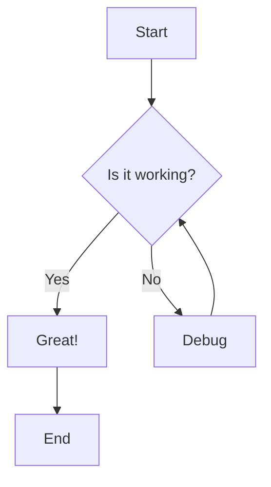
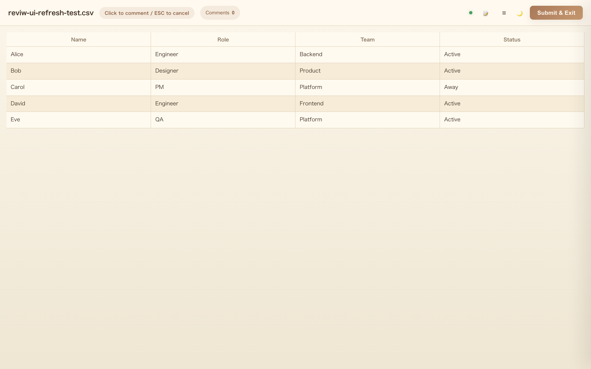

# Sample Document with YAML Frontmatter

This document tests various features of reviw.

## Code Blocks

### JavaScript

```javascript
function greet(name) {
  const message = `Hello, ${name}!`;
  console.log(message);
  return message;
}

const users = ['Alice', 'Bob', 'Charlie'];
users.forEach(user => greet(user));
```

### Python

```python
def fibonacci(n):
    """Generate Fibonacci sequence up to n."""
    a, b = 0, 1
    result = []
    while a < n:
        result.append(a)
        a, b = b, a + b
    return result

print(fibonacci(100))
```

### Bash

```bash
#!/bin/bash
for file in *.md; do
  echo "Processing: $file"
  wc -l "$file"
done
```

### JSON

```json
{
  "name": "reviw",
  "version": "0.8.0",
  "features": ["csv", "markdown", "diff"]
}
```

### YAML

```yaml
database:
  host: localhost
  port: 5432
  credentials:
    username: admin
    password: secret
```

## Inline Code

This is `inline code` example. You can also use `const x = 42;` inline.

## Mermaid Diagram



## Images



## Table

| Feature | Status |
|---------|--------|
| YAML Frontmatter | Testing |
| Syntax Highlight | Testing |
| Mermaid | Testing |
